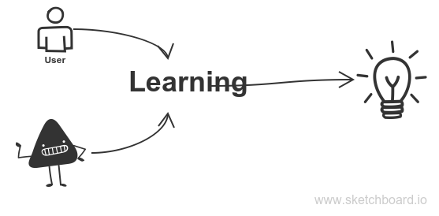

  Howdy! This is an post talks about indetail about Machine Learning

I don't want confuse with many terms on ML topic. I am trying make it as simple as, when i was learned ML lessons

### I do not know what is Machine Learning?
In my point of view machine learning fetch important data from machines/software.

### What i can get it from?
You can make decisions.

### What if did not took any decision?
It will become very difficult to make predictions.

-----

Send an <a href="mailto:malli.kv2@gmail.com?subject=POST:%20Bottom%20to%20top%20approach%20for%20list%20comprehension">Email</a> if you any have comments/suggestions.

