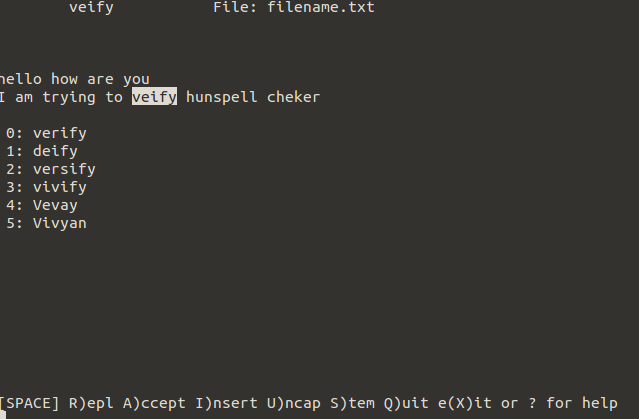
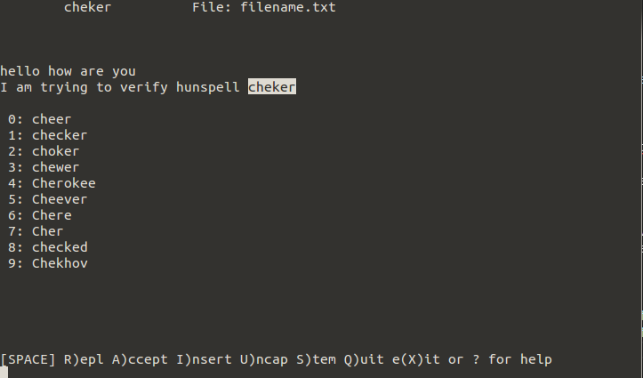

Hunspell is the spell checker of [LibreOffice](http://www.libreoffice.org/), [OpenOffice.org](http://www.openoffice.org/), [Mozilla Firefox 3 & Thunderbird](http://www.mozilla.com/en-US), Google Chrome, and it is also used by proprietary software packages, like macOS, InDesign, memoQ, Opera and SDL Trados.

### Install Hunspell

For installation Clone master branch into local scope

```Bash
git clone https://github.com/hunspell/hunspell.git
```

The instruction are documented into hunspell README.md page

* [Compiling on GNU/Linux and Unixes](https://github.com/hunspell/hunspell#compiling-on-gnulinux-and-unixes)
* [Compiling on OSX and macOS](https://github.com/hunspell/hunspell#compiling-on-osx-and-macos)
* [Compiling on Windows](https://github.com/hunspell/hunspell#compiling-on-windows)

### Verify

```Bash
vkosuri@vm-vkosuri:~$ hunspell -v
@(#) International Ispell Version 3.2.06 (but really Hunspell 1.3.2)


Copyright (C) 2002-2008 László Németh. License: MPL/GPL/LGPL.

Based on OpenOffice.org's Myspell library.
Myspell's copyright (C) Kevin Hendricks, 2001-2002, License: BSD.

This is free software; see the source for copying conditions.  There is NO
warranty; not even for MERCHANTABILITY or FITNESS FOR A PARTICULAR PURPOSE,
to the extent permitted by law.

```

### Usage

I made a document which has some spell mistake, lets try to use hunspell to correct spell check in *filename.txt*

``` Bas
vkosuri@cn-vm-vkosuri$ cat filename.txt 
hello how are you
I am trying to veify hunspell cheker
```

``hunspell filename.txt`` will launch another window to check, in below image shows list available to words to correct verify.

### Commands

```Bash
R       Replace the misspelled word completely.
Space   Accept the word this time only.
A       Accept the word for the rest of this session.
I       Accept the word, and put it in your private dictionary.
U       Accept and add lowercase version to private dictionary.
S       Ask a stem and a model word and store them in the private dictionary.
        The stem will be accepted also with the affixes of the model word.
0-n     Replace with one of the suggested words.
X       Write the rest of this file, ignoring misspellings, and start next file.

Q       Quit immediately. Asks for confirmation. Leaves file unchanged.
^Z      Suspend program. Restart with fg command.
?       Show this help screen.
```






### Setting Dictionary ENV Variable

hunspell always look for **DICPATH** environment variable to load dictionary, 

```Bash
vkosuri@vm-vkosuri:~$ tail -l ~/.profile 
if [ -d "$HOME/bin" ] ; then
    PATH="$HOME/bin:$PATH"
fi

export DICPATH=~/custom_dicitionary/

```


### Check Spell check directories

Three pieces here needs to look into **SEARCH PATH**,  **AVAILABLE DICTIONARIES** and **LOADED DICTIONARY**

* The search path used to search available dictionaries
* Available dictionaries show that list of available dictionaries on your machine.
* Loaded Dictionary are the dictionary to search.

```Code
vksouri@vm-vkosuri:~$ hunspell -D
SEARCH PATH:
.::/home/vkosuri/custom_dicitionary/:/usr/share/hunspell:/usr/share/myspell:/usr/share/myspell/dicts:/Library/Spelling:/home/developer/.openoffice.org/3/user/wordbook:.openoffice.org2/user/wordbook:.openoffice.org2.0/user/wordbook:Library/Spelling:/opt/openoffice.org/basis3.0/share/dict/ooo:/usr/lib/openoffice.org/basis3.0/share/dict/ooo:/opt/openoffice.org2.4/share/dict/ooo:/usr/lib/openoffice.org2.4/share/dict/ooo:/opt/openoffice.org2.3/share/dict/ooo:/usr/lib/openoffice.org2.3/share/dict/ooo:/opt/openoffice.org2.2/share/dict/ooo:/usr/lib/openoffice.org2.2/share/dict/ooo:/opt/openoffice.org2.1/share/dict/ooo:/usr/lib/openoffice.org2.1/share/dict/ooo:/opt/openoffice.org2.0/share/dict/ooo:/usr/lib/openoffice.org2.0/share/dict/ooo
AVAILABLE DICTIONARIES (path is not mandatory for -d option):
/home/vkosuri/custom_dictionary//en_US
/usr/share/myspell/dicts/hyph_en_CA
/usr/share/myspell/dicts/hyph_pt_PT
/usr/share/myspell/dicts/hyph_ga_IE
/usr/share/myspell/dicts/hyph_en_US
/usr/share/myspell/dicts/hyph_es_ES
/usr/share/myspell/dicts/hyph_en_GB
/usr/share/myspell/dicts/hyph_nl_NL
/usr/share/myspell/dicts/hyph_fi_FI
/usr/share/myspell/dicts/hyph_uk_UA
/usr/share/myspell/dicts/en-GB
/usr/share/myspell/dicts/en_ZA
/usr/share/myspell/dicts/hyph_da_DK
/usr/share/myspell/dicts/hyph_sk_SK
/usr/share/myspell/dicts/hyph_cs_CZ
/usr/share/myspell/dicts/hyph_pt_BR
/usr/share/myspell/dicts/hyph_is_IS
/usr/share/myspell/dicts/en_GB
/usr/share/myspell/dicts/hyph_el_GR
/usr/share/myspell/dicts/hyph_id_ID
LOADED DICTIONARY:
/home/vkosuri/custom_dicitionary/en_US.aff
/home/vkosuri/custom_dicitionary/en_US.dic
Hunspell 1.3.2


```

### Download dictionaries

Here are some of the reference links to download dictionaries

- https://github.com/wooorm/dictionaries
- https://github.com/LibreOffice/dictionaries